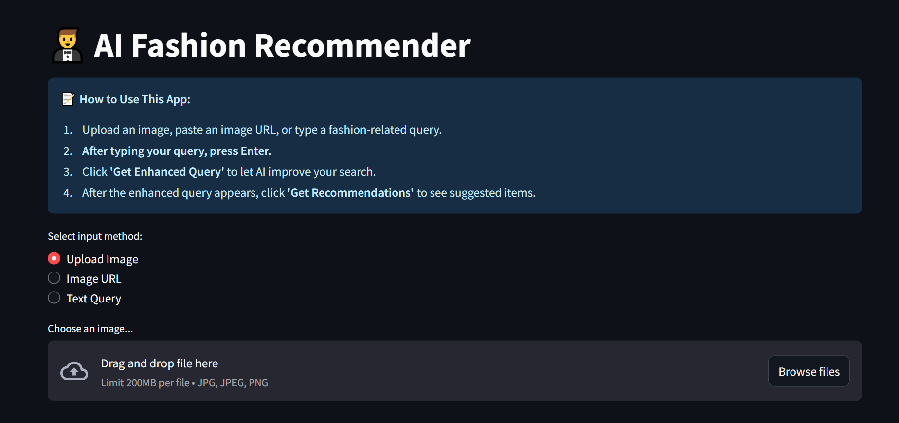

# 🧥 AI Fashion Recommender System

This project is an AI-driven fashion recommendation system built with Streamlit, LLMs, and vector databases. It analyzes user fashion queries, enhances them using a language model, and recommends relevant items using semantic similarity and curated vector search then filter them by LLMs.

---
## 📌 Project Overview

This project implements an intelligent fashion recommendation system with:
- **AI-powered image analysis** for automatic clothing description
- **Vector database** using FAISS for fast similarity search
- **Query enhancement** with LLMs for better intent understanding
- **Streamlit web interface** for interactive exploration

The system uses HuggingFace embeddings for semantic search and integrates with Groq's LLM API for both query rephrasing and final recommendation ranking.

---

## ⚡ Key Features

- **Multi-modal input**: Accepts text queries, image uploads, or image URLs
- **Smart query enhancement**: Uses LLM to rephrase and expand user requests
- **AI image analysis**: Automatically extracts fashion metadata from images
- **Vector similarity search**: Finds visually/textually similar clothing items
- **LLM-powered filtering**: Ranks recommendations using fashion context
- **Interactive web interface**: Built with Streamlit for instant feedback

---
## 📁 File Structure 
- **`build_vec_db.py`**: Script to build vector database from fashion data.
- **`rephrase_query.py`**: improve user queries.
- **`get_vector_recommendation.py`**: Module to fetch similar items from vector store.
- **`Get_Ai_Image_Description.py`**: Module to describe fashion images using AI.
- **`Get_LLM_response.py`**: Module to generate enhanced query and fetch recommendations.
- **`app.py`**: Main Streamlit application.
- **`vector_store/`**: Directory containing the FAISS or vector DB files.
- **`requirements.txt`**: List of required packages.

---

### 🙏 Acknowledgments

This project was made possible thanks to the contributions and support of the following:

- **FAISS** – for providing an efficient similarity search library crucial to building the vector database.
- **Groq** – for enabling high-quality image descriptions and natural language processing through advanced language models.
- **Streamlit** – for the intuitive and rapid development of the interactive web interface.
- **Hugging Face** – for access to pre-trained models and datasets that enhanced the project’s capabilities.

## 🛠️ Installation & Setup

1. **Clone repository**
      ```bash
      git clone https://github.com/abdoghazala7/AI-Fashion-Recommender-System.git 
      cd AI-Fashion-Recommender-System
2. **Install dependencies**
   ```bash
   pip install -r requirements.txt
3. **Set up API key**
   Get your Groq API key from https://console.groq.com/
   Set it in Streamlit: streamlit/secrets.toml
   
5. **Build vector database**
   ```bash
   python build_vec_db.py  # This will download the H&M fashion dataset and create FAISS index

6. **Run the application**
   ```bash
   streamlit run app.py  

### Direct Usage:

If you don't want to deploy the project locally, you can access the live version directly:

- Visit the hosted application at: [Deployed App URL](https://ai-fashion-recommender-system.streamlit.app/)

## Interface Options
Choose one of three input methods:

- **`Upload Image`**: Select a clothing photo from your device
- **`Image URL`**: Paste a link to a fashion image
- **`Text Query`**: Type a description like "casual summer dress"
##### Workflow
- Input your request
- Click "Get Enhanced Query" for AI refinement
- Click "Get Recommendations" to see results
  
---

## 📝 Notes
- First run may take minutes to build vector database
- Requires stable internet connection for API calls
- Can process both local images and URLs
- Some recommendations might be inaccurate due to limited data and incomplete descriptions used for similarity matching.

<h3 align="center">Chat UI</h3>

<p align="center">
  
</p>
